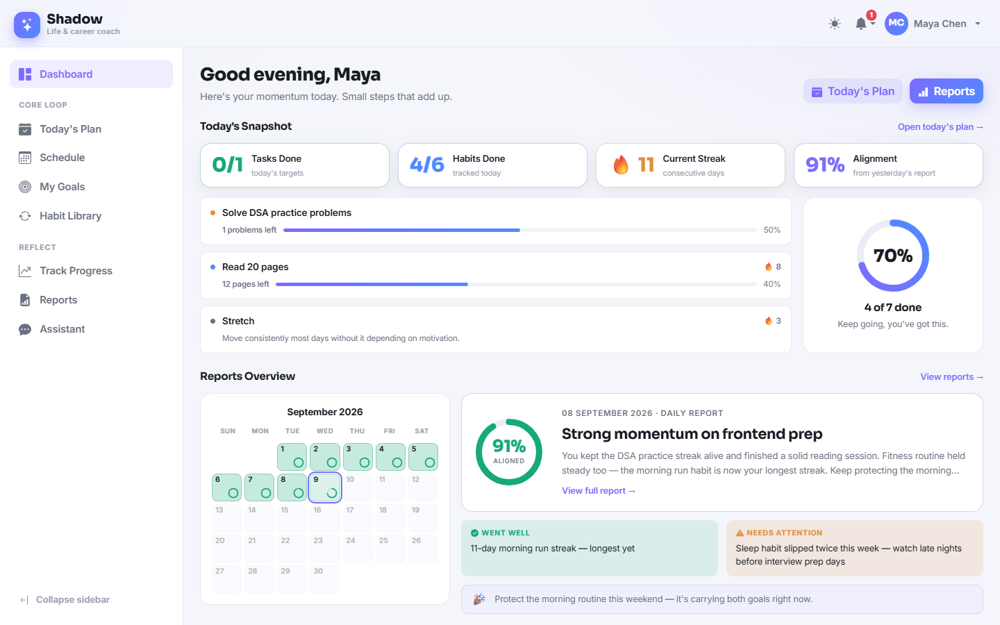
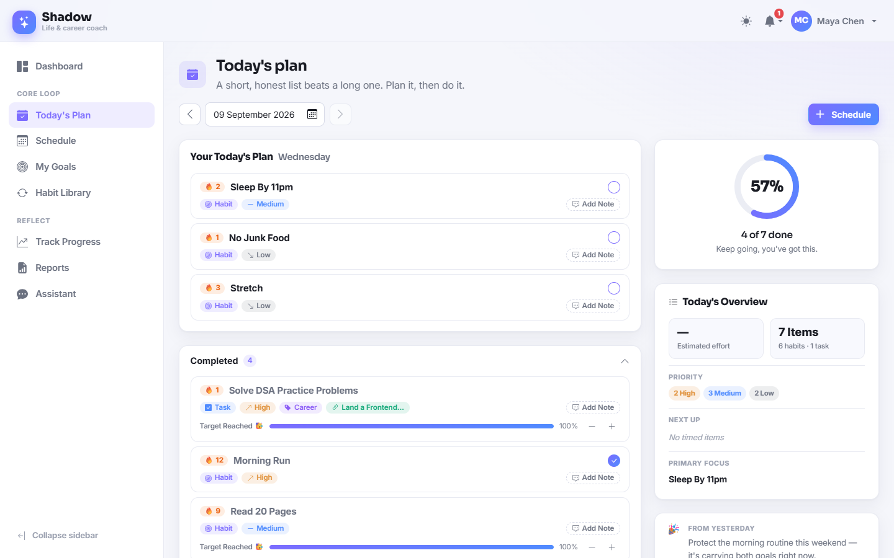
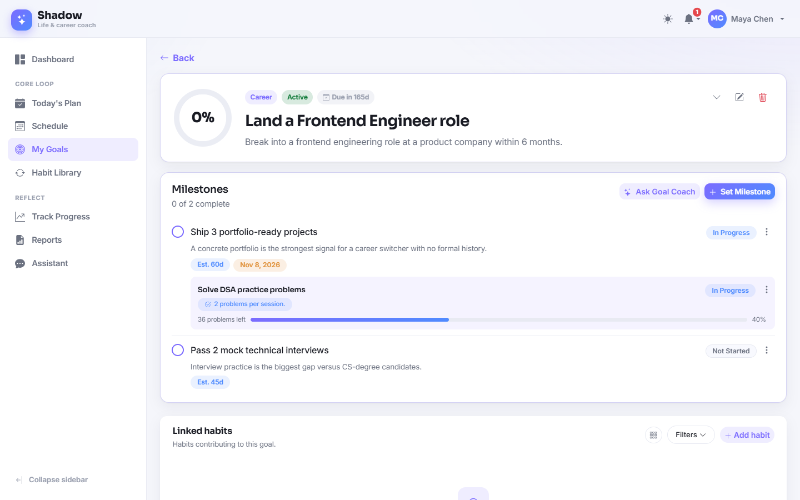
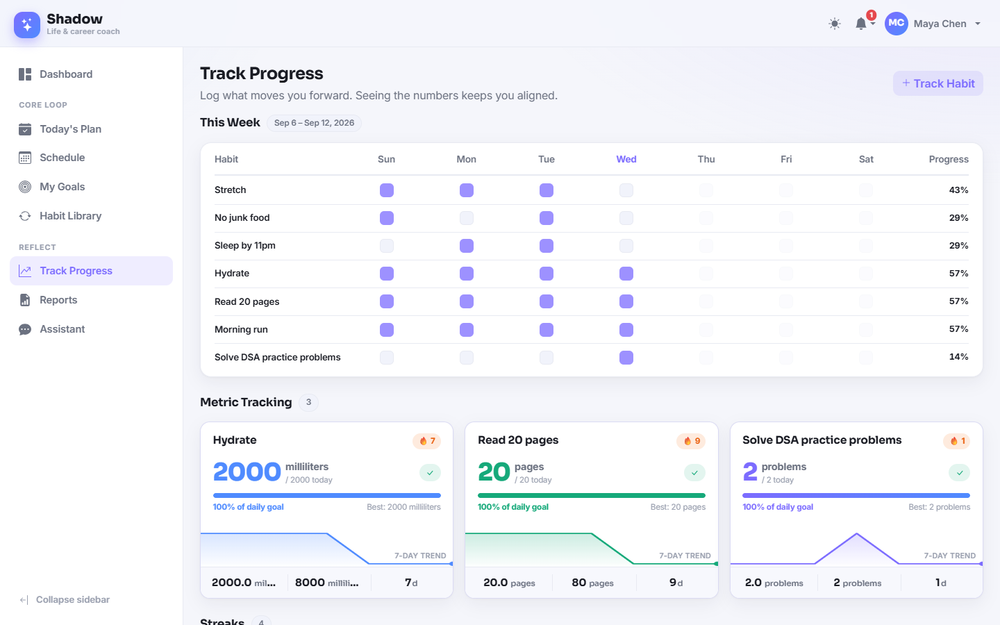
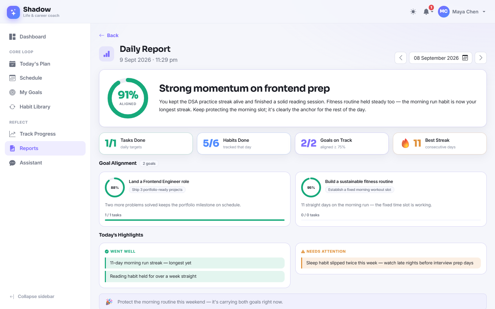
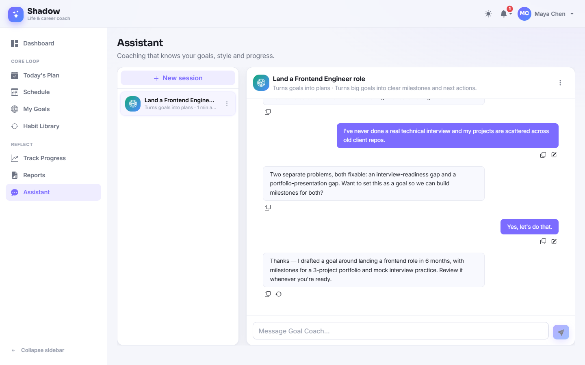
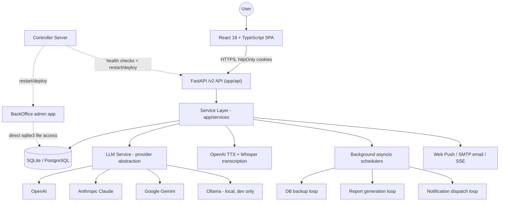
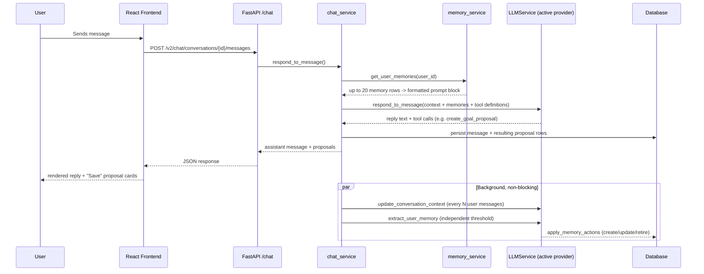

# Shadow

A full-stack personal AI assistant that helps a small group of users plan their day, track goals and habits, and stay accountable through AI-generated reports and a spoken daily briefing.


> This README documents **Shadow V2** — the current, actively developed version of the project, living in [`BackEnd_V2/`](BackEnd_V2) and [`FrontEnd_V2/`](FrontEnd_V2). An earlier iteration (`BackEnd/` / `FrontEnd/`) remains in the repository for reference but is no longer the primary codebase.

---

## Table of Contents

- [What Shadow Is](#what-shadow-is)
- [Product Preview](#product-preview)
- [System Architecture](#system-architecture)
- [Project Structure](#project-structure)
- [Feature Deep Dive](#feature-deep-dive)
- [Technology Stack](#technology-stack)
- [Engineering Decisions](#engineering-decisions)
- [Engineering Challenges Solved](#engineering-challenges-solved)
- [Data Flow Examples](#data-flow-examples)
- [Database Architecture](#database-architecture)
- [Authentication & Security](#authentication--security)
- [BackOffice (Admin Panel)](#backoffice-admin-panel)
- [Controller Server](#controller-server)
- [Testing](#testing)
- [Setup & Installation](#setup--installation)
- [Deployment](#deployment)
- [Engineering Capabilities Demonstrated](#engineering-capabilities-demonstrated)
- [Future Work](#future-work)

---

## What Shadow Is

Shadow is a personal planning and accountability assistant built for a small, private group of users (not a public product). It combines:

- A structured **planning system** (goals → milestones → tasks/habits → daily materialized plan)
- A **multi-agent AI assistant** with tool-calling that can read and propose changes to a user's goals, milestones, tasks, and schedule
- A **persistent, user-scoped AI memory** layer, separate from per-conversation context
- **AI-generated daily and weekly reports** with an alignment score
- A **Daily Brief** — a written and spoken (TTS) summary of the day, with word-level synced captions
- Supporting infrastructure: multi-device session management, web push + email notifications, background schedulers, automated SQLite backups, and multi-provider LLM support (OpenAI, Anthropic Claude, Google Gemini, local Ollama)

The backend (`BackEnd_V2`) is a FastAPI application; the frontend (`FrontEnd_V2`) is a React + TypeScript single-page app. Two small supporting services — [BackOffice](#backoffice-admin-panel) (an admin panel) and [Server](#controller-server) (a process controller) — exist around the core product.

---

## Product Preview

Screenshots below are pulled directly from `FrontEnd_V2/src/assets/landing/` (each page ships both a light and dark capture).

| Dashboard | Today's Plan |
|---|---|
|  |  |

| Goal Detail | Track Progress |
|---|---|
|  |  |

| Report Detail | AI Assistant |
|---|---|
|  |  |

<sub>Dark-mode equivalents ship alongside each of the above (`*-dark.png` in the same folder).</sub>

> TODO: Workout, Diet, Journal, Daily Brief, and Settings screenshots are not yet captured in the repository.

---

## System Architecture



Only components that are actually implemented are shown. There is no message broker, vector database, or container orchestration layer in this system — persistence is a single SQLAlchemy-modeled database, and "background workers" are asyncio tasks inside the same FastAPI process, not separate services.

---

## Project Structure

```text
BackEnd_V2/
├── app/
│   ├── api/            # FastAPI routers (thin) - one file per feature domain
│   ├── services/       # Business logic - conversations, goals, planning, reports, brief, memory, schedulers
│   ├── models/          # SQLAlchemy 2.0 declarative models
│   ├── schemas/         # Pydantic request/response/DB-mirror schemas (see docs/naming-conventions.md)
│   ├── llm/             # Provider-agnostic LLM layer: base interface, providers/, tools/, cost.py, knowledge_base.py
│   ├── core/            # Settings, JWT/security, exception hierarchy, endpoint path constants
│   ├── db/              # Engine/session setup
│   ├── analysis/        # Optional LLM usage/cost logging + Google Sheets export
│   ├── validators/       # Field-level validation (email, password, date, bio, ...)
│   └── main.py          # App wiring, middleware, lifespan (startup tasks + background loops)
├── docs/                # ASSISTANT_MEMORY_SYSTEM.md, naming-conventions.md
├── backups/             # Rotated SQLite backups written by backup_service
└── restart_server.sh    # Process-group-safe restart script (multi-worker uvicorn)

FrontEnd_V2/
├── src/
│   ├── pages/           # One folder per route: dashboard, plan, my_goals, habit_library,
│   │                    #   track_progress, reports, assistant, daily-brief, settings, profile, auth, ...
│   ├── api/             # Axios client + one typed module per backend domain
│   ├── context/         # Auth, Theme, Accessibility, Planner, Toast providers (no Redux)
│   ├── components/      # layout/ (Sidebar, Topbar, AppLayout) and ui/ (buttons, cards, dialogs, forms)
│   ├── hooks/            # useLazyAudio, useUrlAnchor
│   ├── routes/           # Route table + auth guards (RequireAuth, RequireDeviceCheck, PublicOnly)
│   └── constant/         # tuning.ts (animation/UX timing constants), endpoint paths, nav config
└── firebase.json         # Static hosting config (SPA rewrites, asset caching)

BackOffice/               # Separate admin FastAPI + React app (own DB/auth) - see dedicated section
Server/                   # Lightweight process controller/orchestrator - see dedicated section
```

---

## Feature Deep Dive

### Personal Planning

Planning is modeled as **templates that materialize into dated records**, not as a flat to-do list:

- `HabitDBM`, `TaskDBM`, and `ScheduledTaskDBM` describe *what* should happen (frequency, priority, preferred time, whether it's a simple checkbox or a numeric/metric target).
- Each of these is mirrored by a `PlanDBM` row (`source_type` + `source_id`), which represents the recurring plan.
- On each day a user views, `planner_service` materializes the relevant `DailyPlanRecordDBM` rows for that date. These records snapshot the display fields (title, priority, etc.) at materialization time, so history remains readable even if the source habit/task is later edited or deleted (the FK to `plan_id` is nullable for exactly this reason).
- Execution state (`due` / `done` / `missed`, actual numeric value, notes, skip flag) lives on the daily record, and streaks/history are computed from the sequence of records, not from the template.

The **Today's Plan** frontend page reads this materialized view (`GET /v2/planner/for-date`), lets users toggle completion or log numeric progress (`PATCH /v2/planner/records/{id}`), and shows yesterday's AI-generated closing message alongside today's items.

### Goals

- Goals (`GoalDBM`) carry motivation, success definition, current state, and JSON arrays for challenges/strengths/success metrics/insights — populated either manually or by the AI during goal refinement.
- `POST /v2/goal/refine` sends a user's discovery answers to the LLM, which returns a structured goal draft; the user reviews and saves it (`save-goal-from-proposal`) rather than it being silently created.
- Milestones and tasks can also be proposed by the assistant during a `goal_coach` conversation via tool calls, producing `MilestoneProposalDBM` / `TaskProposalDBM` rows that surface as review-and-save cards in the chat UI (see [Engineering Decisions](#engineering-decisions)).
- Goal progress is derived from milestone/habit/task counters maintained on the `GoalDBM` row (`milestones_total`, `milestones_completed`, `habits_total`, `habits_active`).

### AI Assistant

- Conversations (`ConversationDBM`) are scoped to one of four agent types — `shadow`, `goal_coach`, `career_advisor`, `insights` — each wired to a different subset of tools in `app/llm/tools/` (goal/milestone/task/schedule read-and-propose functions).
- Every provider implements the same 10-method `BaseLLMProvider` interface (`respond_to_message`, `create_conversation`, `update_conversation_context`, `extract_user_memory`, `generate_report`, `generate_daily_brief`, `refine_goal`, milestone/task proposal generation, `health_check`, `close`), so `chat_service` and every other caller never talks to a specific vendor SDK directly.
- Two independent, message-count-gated background passes run after a reply is sent: a **context summary update** (`stable_context` / `context_summary`, keeps conversations coherent without resending full history) and a **memory extraction** pass (see below) — each with its own threshold (`chat_summary_update_user_messages`, `chat_memory_extraction_user_messages`), so a conversation can stay "in flow" long before anything is promoted to durable memory.
- Assistant replies that imply an action (create a goal, add a milestone, schedule a task) are surfaced as **proposal cards**, not auto-applied — the user explicitly saves them.

### AI Memory

Shadow separates two different kinds of "memory," and this separation is the core design decision documented in `docs/ASSISTANT_MEMORY_SYSTEM.md`:

- **Conversation context** (`stable_context`, `context_summary` on `ConversationDBM`) — keeps a *single* conversation coherent over many turns.
- **User memory** (`UserMemoryDBM`, table `user_memories`) — durable facts that should be available in *any* conversation, typed as `preference | progress | decision | constraint | knowledge | plan | history`, with a free-form JSON `content` field whose internal shape is decided by the LLM per topic rather than fixed by the schema.

How it works end to end:
1. On each message, `chat_service` fetches up to 20 of the user's memory rows and renders them into a text block injected into the system prompt.
2. Every `chat_memory_extraction_user_messages` (default 3) user turns, an async, non-blocking task asks the LLM whether anything in the recent exchange is worth remembering.
3. The LLM returns a structured action per candidate memory: `create | update | retire | none`, plus `memory_type`, `topic`, `content`, and `reasoning`. `apply_memory_actions()` performs the corresponding write.
4. Because updates target an existing `(memory_type, topic)` rather than always inserting, duplicate/contradictory memories are avoided by construction rather than by a dedup pass.
5. There is deliberately no vector database or embeddings involved — retrieval is a plain SQL query scoped to the user, and injection is a plain prompt block. The extraction pass is fire-and-forget: if it fails, the user-facing reply is unaffected.

### Reports

- `ReportDBM` stores one row per `(user, date, report_type)` — `daily` or `weekly` — with an `alignment_score`, a `headline`/`summary`, and structured JSON (`stats`, `goals`, `highlights`, `closing`) rather than free text, so the frontend can render structured cards instead of parsing prose.
- Reports are generated either on demand (`POST /v2/reports/{date}/request`) or by `report_scheduler_service`, an asyncio loop that polls every 30 seconds and fires generation at each user's configured time (`UserSettingDBM.reports`, default 23:55 IST). A process-file-based singleton lock (`app/common/proc_lock.py`) ensures only one of the (potentially 4) uvicorn workers actually runs a given user's report, since they all share the same poll loop.
- Report content mixes raw statistics (tasks/habits/schedule completion counts) computed from `DailyPlanRecordDBM` history with an LLM-authored interpretation layer (highlights, attention areas, per-goal alignment commentary, a closing message in one of several tones).
- Reports can be emailed (`POST /v2/reports/{date}/email`) and are also shown month-by-month in the Reports UI.

### Daily Brief

The Daily Brief produces **three distinct LLM outputs from the same day's plan**, not one text reused in different places:

| Output | Purpose |
|---|---|
| `short_brief` | One-line push/email notification |
| `complete_brief` | Full written brief rendered on the `/daily-brief` page |
| `spoken_brief` | Shorter, conversational rewrite with no lists/markdown — written specifically to be read aloud |

Audio generation (`daily_brief_audio_service`) synthesizes `spoken_brief` with OpenAI TTS, then immediately re-transcribes that *same generated audio* with Whisper (`verbose_json`, word-level timestamps) to get real, ground-truth word timings — not a text-length heuristic. Both the MP3 bytes and the timing JSON are cached together in one `daily_brief_audio` row, keyed by `(user_id, brief_date)`, so replaying the brief never re-calls the TTS API. On the frontend, `useLazyAudio` lazy-loads the audio blob on first play, and captions are grouped into short reading lines (4–8 words, capped duration, pause-aware) synced against the real timestamps rather than estimated. A typewriter reveal of the written brief is skipped entirely when the user has reduced-motion accessibility enabled.

### Wellbeing (Workout / Diet / Journal)

Routes for `/workout`, `/diet`, and `/journal` exist in the frontend router and sidebar, but currently render as **"coming soon" placeholder pages** — there is no corresponding backend model or service for these in `BackEnd_V2` yet. This section is intentionally left honest rather than describing planned functionality as shipped.

### Settings

`UserSettingDBM` stores one JSON column per settings domain, each with its own card in the Settings UI: **appearance** (theme: browser/light/dark/dynamic), **planner** (week start, 12h/24h time, date format, default task duration), **notifications** (master toggle, email, quiet hours), **AI behavior** (response length, personality style, provider/model choice, optional custom API key), **accessibility** (reduced motion, high contrast, font scale), **reports** (auto-generation on/off, schedule time, email delivery), plus session management (list/rename/revoke active devices) and account privacy controls (memory on/off, max concurrent devices, data export, account deactivation/deletion).

---

## Technology Stack

| Layer | Technology | How it's actually used |
|---|---|---|
| Frontend | React 18 + TypeScript + Vite | SPA with route-level code splitting (`React.lazy`); no server-side rendering |
| Frontend UI | Bootstrap 5 + react-bootstrap + Sass | Component styling with CSS-variable-driven light/dark theming |
| Frontend state | React Context (Auth, Theme, Accessibility, Planner, Toast) | No Redux/Zustand — cross-tab sync is done via custom browser events + localStorage, not a state library |
| Frontend HTTP | Axios | Single client with `withCredentials: true` (httpOnly cookies), a coordinated single-flight refresh-then-retry on 401, and normalized error shapes |
| Frontend content | react-markdown + remark-gfm + DOMPurify | Assistant replies are rendered as sanitized Markdown, not raw HTML injection |
| Backend | Python 3.11+ + FastAPI | Routers in `app/api` stay thin; all business logic lives in `app/services`, so the same service functions are reusable from background schedulers, not just HTTP handlers |
| ORM | SQLAlchemy 2.0 (declarative) | Models in `app/models`; schema created via `Base.metadata.create_all()` at startup |
| Validation | Pydantic v2 + pydantic-settings | Request/response schemas plus typed `.env`-backed settings objects |
| Database | SQLite (default) / PostgreSQL-ready via `DATABASE_URL` | Single-writer SQLite with `PRAGMA foreign_keys=ON` enabled per connection; swapping to Postgres is a connection-string change |
| Auth | JWT (python-jose) in httpOnly cookies + bcrypt (passlib) | Access + refresh tokens, both httpOnly so they're inaccessible to page JavaScript; paired with a custom CSRF origin-check middleware for state-changing requests |
| AI/LLM | OpenAI, Anthropic Claude, Google Gemini, Ollama | All behind one `BaseLLMProvider` interface selected by `LLM_PROVIDER` env var or per-user custom key; Ollama is local/free and dev-only |
| TTS/STT | OpenAI TTS (`gpt-4o-mini-tts`) + Whisper | TTS produces the spoken brief; Whisper re-transcribes that same audio for real word-level caption timing |
| Background jobs | asyncio tasks spawned in FastAPI's lifespan | Backup, report, and notification loops — no Celery/RQ/external queue |
| Realtime | Server-Sent Events (SSE) | Live notification delivery to the frontend without polling |
| Push | Web Push (VAPID via `pywebpush`) | Browser push subscriptions stored per user |
| Email | SMTP (stdlib) | Verification, password reset, report delivery, security alerts |
| Analytics (optional) | Google Sheets API (`gspread`) | Off by default; when enabled, every LLM call's token count and INR cost is appended to a worksheet |
| Testing | Vitest + Testing Library (frontend), pytest (V1 backend) | See [Testing](#testing) for current coverage status |
| Hosting | Firebase Hosting (frontend, static SPA build) | Backend runs as a long-lived uvicorn process (see [Deployment](#deployment)) |

---

## Engineering Decisions

**Provider-agnostic LLM abstraction.** Every feature that touches an LLM (chat, goal refinement, report generation, daily brief, memory extraction) calls `LLMService`, which delegates to whichever `BaseLLMProvider` implementation is configured. Adding a fifth provider means implementing one class against the existing 10-method interface — no call site elsewhere in the codebase needs to change. This also lets individual users override the app-wide default with their own API key/model in Settings.

**Conversation context vs. long-term memory as two separate concepts.** Rather than trying to solve "remember everything forever" with one mechanism, the system keeps a short-lived per-conversation summary (`stable_context`/`context_summary`) and a long-lived, user-scoped `user_memories` table, updated on independent cadences. This keeps single conversations cheap to run (a compact summary instead of full history) while still letting facts learned in one conversation show up in a completely different one later.

**Database-backed memory instead of vector infrastructure.** Memory retrieval is a plain SQL query for a user's rows, and injection is a formatted text block in the system prompt — there is no embeddings pipeline or vector store. This is a deliberate trade for a private, low-user-count product: it avoids an entire infrastructure dependency at the cost of not doing semantic similarity search, which is documented explicitly in `docs/ASSISTANT_MEMORY_SYSTEM.md` as the chosen scope.

**Plan templates vs. materialized daily records.** Recurring items (habits/tasks/scheduled tasks) are stored once, but every day's execution state is snapshotted into its own `DailyPlanRecordDBM` row with a nullable FK back to the template. This means editing or deleting a habit doesn't rewrite history — past days keep showing exactly what was planned and done, which is what streak/report calculations depend on.

**AI proposes, user confirms.** Tool-calling actions that create or modify durable data (goals, milestones, tasks, scheduled tasks) write to dedicated `*_proposal` tables and surface as review cards in the UI, rather than being applied directly to the live tables. This keeps AI actions auditable and reversible before they become real user data.

**Scheduler coordination across multiple uvicorn workers.** The backend runs with multiple worker processes (4 by default) for throughput, but background loops (backups, reports, notifications) must only run once per tick. A procfs-based file lock (`app/common/proc_lock.py`) makes exactly one worker the active scheduler at a time, self-releasing if that worker's PID disappears.

**Cookie-based JWT with CSRF middleware.** Access and refresh tokens are set as httpOnly cookies rather than returned to JavaScript and stored client-side, which removes them from the XSS attack surface. Because cookies are sent automatically by the browser, a custom origin-check middleware rejects non-GET/HEAD/OPTIONS requests whose `Origin` header isn't in the configured allow-list, closing the CSRF gap that cookie auth otherwise opens.

**TTS and captions generated together, not separately.** Word-level caption timing is derived by re-running Whisper transcription on the exact audio just produced by TTS, rather than estimating timing from text length/word count. This guarantees the captions the frontend displays are ground-truth accurate to the actual audio file being played, at the cost of one extra API call per brief (amortized by caching).

---

## Engineering Challenges Solved

- **Multi-provider LLM architecture** with per-provider structured-output handling (each provider has a different native mechanism for constrained JSON) unified behind one request/response model layer (`app/llm/models.py`).
- **Tool-calling loops with bounded iteration** — `execute_tool()` runs inside a loop capped by `MAX_TOOL_ITERATIONS` with designated `TERMINAL_TOOL_NAMES`, preventing an agent from looping indefinitely across goal/milestone/task/schedule tools.
- **Preventing duplicate/contradictory memories** without a dedup pass, by having the LLM target `update`/`retire` at an existing `(memory_type, topic)` instead of always inserting new rows.
- **SQLite concurrency under multiple workers** — foreign keys enabled per-connection, a single-writer database, and a procfs lock so only one worker executes each scheduled job, while backups exclude the largest table (`daily_brief_audio`) to keep backup files small and fast.
- **Historical accuracy after data changes** — daily plan records snapshot enough fields to render correctly even after their source habit/task is edited or deleted, which is what makes multi-week streaks and past reports trustworthy.
- **Ground-truth audio captions** by transcribing the exact generated TTS output instead of estimating timing from text.
- **Session security on a cookie-based auth model** — refresh coordination is single-flight on the frontend (concurrent 401s don't trigger duplicate refresh calls), and the backend independently rate-limits by IP and locks out by account after repeated failures.

---

## Data Flow Examples

### Chat Request (with tool calling)



### Daily Report Generation

```
Scheduled 30s poll (report_scheduler_service)
  -> singleton lock acquired by one worker
  -> user's configured report time reached
  -> pull DailyPlanRecordDBM history for the period
  -> reports_service.generate_report() calls LLMService.generate_report()
  -> structured JSON (stats, goals, highlights, closing, alignment_score)
  -> saved to ReportDBM
  -> notification created + optional email sent
  -> Reports UI renders the stored structured payload
```

### Daily Brief

```
Today's materialized plan (DailyPlanRecordDBM rows for the date)
  -> daily_brief_service builds short_brief / complete_brief / spoken_brief via LLM
  -> saved to DailyBriefDBM, linked to a NotificationDBM row
  -> on first playback request: daily_brief_audio_service
       -> OpenAI TTS synthesizes spoken_brief -> audio bytes
       -> Whisper transcribes that audio -> word-level timings
       -> both cached in DailyBriefAudioDBM (audio_data + word_timings)
  -> frontend fetches audio once, plays it, syncs captions off cached timings
```

---

## Database Architecture

The schema is organized around one core idea: **templates describe recurring intent, records capture what actually happened on a given date.**

- **Identity & access:** `users` → `active_sessions` (multi-device), `push_subscriptions`, `user_settings` (1:1, JSON per domain), `ip_rate_limits` (shared across workers).
- **Goal hierarchy:** `goals` → `milestones` → `tasks`, plus `habits` and `scheduled_tasks` linked to a goal (nullable FK, `SET NULL` on delete — losing a goal doesn't delete the habit). `yearly_tasks` act as templates that generate `scheduled_tasks` occurrences on configured dates.
- **Planning:** `plans` (one row per `(user, source_type, source_id)` — habit/task/schedule) → `plan_records` (materialized per date, unique per `(plan_id, scheduled_date)`, `plan_id` nullable so history survives template deletion). Indexed for both "everything for this user on this date" and "has this plan already been materialized for this date" lookups.
- **Conversations & AI:** `conversations` (per-agent-type, holding `stable_context`/`context_summary` and a `linked_items` JSON pointer to related proposals) → `messages`; separately, `user_memories` (durable, cross-conversation). Four proposal tables (`goal_proposals`, `milestone_proposals`, `task_proposals`, `scheduled_task_proposals`) link a conversation/message back to a pending, user-reviewable action.
- **Reporting & briefing:** `reports` (one per `user + date + type`, structured JSON payload) and `daily_briefs` → `daily_brief_audio` (binary audio + JSON word timings, cached, excluded from routine backups because it's cheaply regenerable).
- **Notifications:** `notifications` with a `(user_id, event_key)` unique constraint used purely for deduplication of event-triggered alerts (e.g., don't send "milestone due soon" twice for the same milestone).

No columns are dumped exhaustively here — the intent above is the part that matters architecturally; exact field lists live in `app/models/`.

---

## Authentication & Security

- **Passwords** are hashed with bcrypt via passlib; registration and password-change enforce length plus mixed-case/digit/special-character requirements.
- **Sessions** use short-lived JWT access tokens and longer-lived refresh tokens, both stored as **httpOnly cookies** (not `localStorage`), removing them from direct JavaScript/XSS reach. A custom middleware rejects state-changing requests whose `Origin` header isn't on the CORS allow-list, mitigating CSRF for the cookie-auth model.
- **Account lockout**: 5 failed logins locks an account for 15 minutes; a separate, shared `ip_rate_limits` table locks out an *IP* after repeated failed logins or registrations (works correctly across multiple uvicorn workers because it's DB-backed, not in-process memory).
- **Multi-device session management**: every login creates an `active_sessions` row; a configurable per-user device limit blocks further logins until an old session is revoked (frontend enforces this with a dedicated `/device-limit` wall).
- **Email verification** is required, using a time-limited token; password reset follows the same pattern.
- **Optional IP geolocation** on failed-login security alert emails is off by default and looked up in a background thread — it never blocks or fails the request path.
- **Secrets hygiene**: `.env` and the `credentials/` folder (Google service-account JSON used only for optional analytics export) are both git-ignored; database files (`*.db`) are also git-ignored. No API keys or credentials are committed to this repository.
- **AI-rendered content is sanitized**: assistant Markdown replies are rendered through `react-markdown` + `DOMPurify`, not injected as raw HTML.
- **Data isolation**: every domain query is scoped by `user_id` at the service layer; there is no cross-user data access path in the API surface reviewed.

This documents what is implemented — it is not a claim of a completed security audit.

---

## BackOffice (Admin Panel)

`BackOffice/` is a separate, small FastAPI + React admin application used to operate the main Shadow backend, not a user-facing part of the product. It has its own database and its own JWT-based admin login (`AdminUserDBM`), independent of the main app's auth.

Because BackOffice and `BackEnd_V2` are co-located on the same machine, BackOffice reads `shadow.db` **directly via `sqlite3`** rather than over HTTP — giving it a SQL console, database backup create/list/restore/delete, and server log tailing without needing any privileged endpoint on the public-facing API. It can also trigger a git pull + restart of the main backend. This replaced an earlier design where `BackEnd_V2` exposed its own admin-secret-gated endpoints for these operations; that surface was deleted once BackOffice could reach the same SQLite file directly, removing a shared-secret dependency between the two apps entirely.

## Controller Server

`Server/` is a minimal FastAPI process controller that runs independently of both the main backend and BackOffice, on its own port. It exposes health checks for both apps (`/health/main`, `/health/backoffice`), triggers restarts/deploys/rollbacks via the existing shell scripts, tails logs, and forwards ad-hoc SQL queries — effectively a remote control plane for operating the two apps from outside either one. It assumes a trusted network (no authentication of its own) and is intentionally kept separate so that restarting the main backend doesn't also take down the mechanism used to restart it.

---

## Testing

- **Frontend (`FrontEnd_V2`)**: Vitest + React Testing Library are fully configured (`npm run test`, `npm run test:watch`, `npm run test:coverage`), but no test files currently exist in the V2 frontend — this is a known gap, not a hidden one.
- **Backend (`BackEnd_V2`)**: no test suite currently exists. The earlier `BackEnd/` (V1) codebase has an extensive pytest suite (`BackEnd/tests/`, covering auth, goals, memory, reports, scheduler jobs, etc.), but it targets the V1 schema/services and has not been ported to V2.

This is documented honestly rather than glossed over: **test coverage for V2 is a real, current limitation**, not a stated future improvement.

---

## Setup & Installation

### Prerequisites
- Python 3.11+
- Node.js 18+

### Backend (`BackEnd_V2`)

```powershell
cd BackEnd_V2
python -m venv .venv
.\.venv\Scripts\Activate.ps1
pip install -r requirements.txt
Copy-Item .env.example .env
# edit .env: JWT_SECRET, an LLM provider key (GEMINI_API_KEY / CLAUDE_API_KEY / etc.), CORS_ORIGINS
uvicorn app.main:app --reload --port 8000
```

- API root: `http://localhost:8000`
- No Alembic migration step is required for a fresh database — tables are created automatically at startup (`Base.metadata.create_all`).
- `.env.example` documents every supported variable, including optional SMTP, Google Sheets analytics, and DB backup scheduling.

### Frontend (`FrontEnd_V2`)

```powershell
cd FrontEnd_V2
npm install
npm run dev
```

- App: `http://localhost:5173` (Vite dev server proxies `/api` to `http://localhost:8000`)
- Production env vars (`VITE_API_BASE_URL`, `VITE_API_TIMEOUT_SECONDS`) are read from `.env`/`.env.production` — not committed to the repo.

### Notes
- If something isn't listed above (e.g. a required system package), it was not verifiable from the repository and is intentionally not guessed here.

---

## Deployment

- **Frontend**: static Vite build deployed to Firebase Hosting. `package.json` defines separate `deploy` / `deploy-stg` / `deploy-dev` scripts, each building against a different mode and deploying either to production hosting or a time-limited Firebase preview channel.
- **Backend**: runs as a long-lived `uvicorn` process with 4 workers (`restart_server.sh`), started/stopped via process-group signals (`setsid`/`pkill`) rather than a container runtime — there is no Dockerfile or systemd unit in this repository. The script waits for the port to free before restarting and logs to `server.log`.
- **Background workers**: not separate processes — the three scheduler loops (backup, report, notification) run as asyncio tasks inside the same FastAPI process, coordinated across the 4 uvicorn workers by a procfs-based file lock so each scheduled job only executes once.
- **Database**: SQLite by default; switching to PostgreSQL is a single `DATABASE_URL` change with no code changes required (connection pooling is already configured conditionally in `app/db/session.py` for the non-SQLite case).
- **Operational tooling**: [BackOffice](#backoffice-admin-panel) and [Server](#controller-server) exist specifically to operate this deployment model (restart, deploy, roll back, inspect logs/DB) without SSH-ing in for every routine action.

---

## Engineering Capabilities Demonstrated

- **Full-stack ownership** — a FastAPI service layer and a React/TypeScript SPA, sharing a typed API contract maintained by hand across both sides.
- **REST API design** — 18+ router modules in `app/api`, kept thin, with business logic isolated in `app/services` so it's reusable from background schedulers.
- **Relational data modeling** — recurrence templates vs. dated execution records, nullable FKs to preserve history, JSON columns used deliberately (flexible AI-authored content) rather than everywhere.
- **Authentication & session security** — httpOnly cookie JWTs, CSRF origin-check middleware, account lockout, IP rate limiting, multi-device session limits.
- **Multi-provider AI integration** — one abstract interface across OpenAI, Anthropic, Gemini, and Ollama, with per-user override and cost tracking per call.
- **Tool-calling / agentic design** — bounded tool-execution loops giving an LLM read/propose access to structured application data.
- **Long-term AI memory design** — a from-scratch, database-backed (no vector infra) persistent memory system with explicit create/update/retire semantics, documented in `docs/ASSISTANT_MEMORY_SYSTEM.md`.
- **Background processing & scheduling** — three asyncio scheduler loops coordinated across multiple worker processes via a custom file lock.
- **Audio/TTS pipeline** — TTS generation paired with real transcription-based caption timing, with binary caching to avoid repeat API cost.
- **Pragmatic engineering trade-offs, stated explicitly** — e.g., choosing SQL+prompt-injection memory over vector search for a small private user base, and being explicit in this document about what is *not* yet implemented (V2 tests, Workout/Diet/Journal) rather than overstating scope.

---

## Future Work

- Port or rewrite the automated test suite for `BackEnd_V2` and add frontend test coverage (infrastructure is already configured on both sides).
- Implement backend support for Workout, Diet, and Journal, which currently exist only as frontend placeholder routes.
- Roll out the `save_user_memory` feature flag more broadly (currently defaults to off) once extraction quality is validated further.
